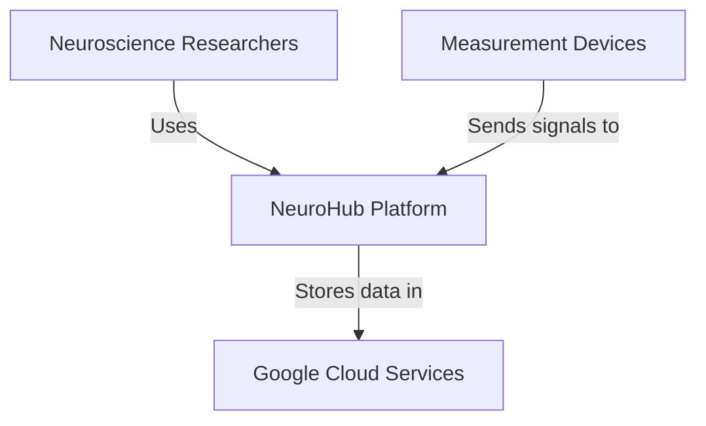
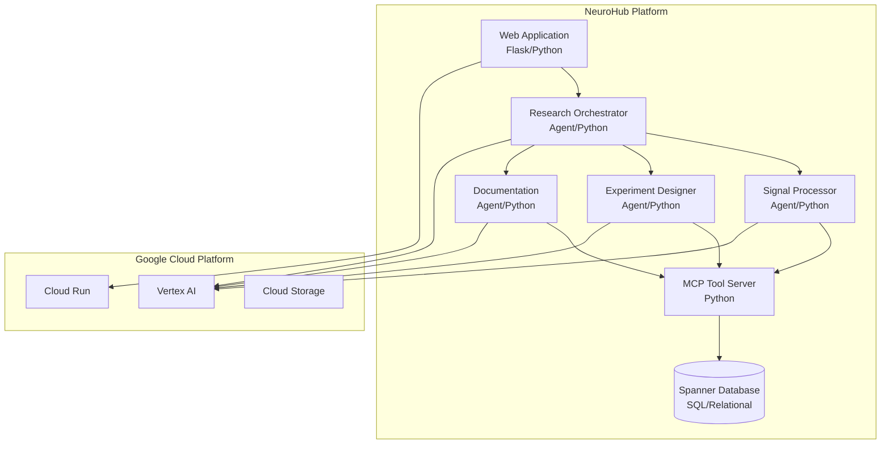
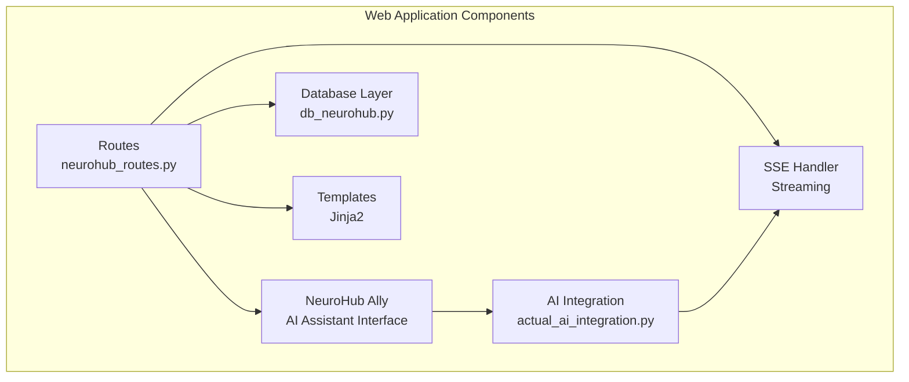
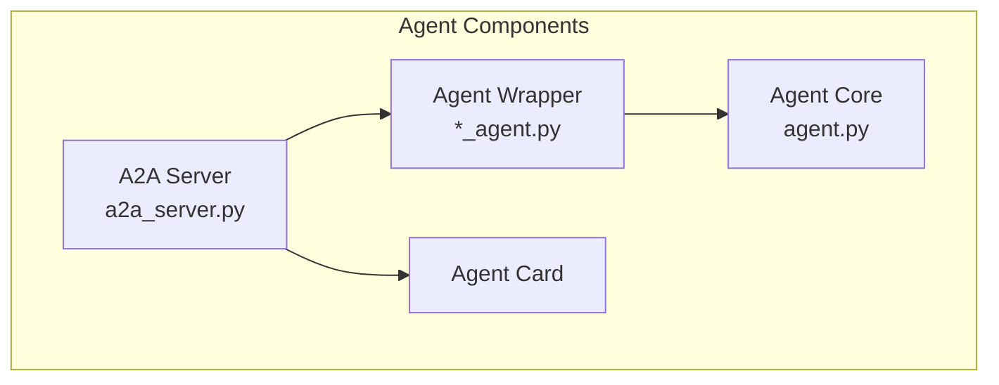

# C4 Architecture: NeuroHub Platform

This document describes the NeuroHub architecture using the C4 model (Context, Containers, Components, Code).

## Level 1: System Context



### Context Description
- **Users**: Neuroscience researchers conducting experiments
- **NeuroHub Platform**: Multi-agent AI system for research automation
- **Google Cloud**: Infrastructure for data storage, AI, and hosting
- **Devices**: EEG, EMG, ECG measurement equipment

## Level 2: Container Diagram



### Container Responsibilities

| Container | Technology | Purpose | Port |
|-----------|------------|---------|------|
| Web Application | Flask/Python | User interface, API endpoints, NeuroHub Ally | 8080 |
| Research Orchestrator | ADK/A2A | Coordinates agent workflows | 8005 |
| Signal Processor | ADK/A2A | Analyzes biosignals | 8003 |
| Experiment Designer | ADK/A2A | Creates research protocols | 8004 |
| Documentation Agent | ADK/A2A | Generates reports | 8002 |
| MCP Tool Server | FastMCP/Python | Provides tools to agents (native MCP) | 8001 |
| Spanner Database | Google Spanner | Stores research data | - |

## Level 3: Component Diagram (Web Application)



### Component Details

**Routes Component**
- Handles HTTP requests
- Implements REST APIs
- Manages session state

**NeuroHub Ally**
- AI research assistant interface
- Routes queries to appropriate agents
- Provides fallback responses when agents offline
- Displays real-time agent responses

**AI Integration**
- Discovers available A2A agents
- Routes queries based on content
- Handles SSE streaming
- Manages agent communication

**Database Layer**
- Spanner connection management
- SQL queries with JOINs
- Transaction handling

**SSE Handler**
- Real-time updates
- Progress streaming
- Client connection management

## Level 3: Component Diagram (Agent Architecture)



### Agent Pattern
Each agent follows this standard pattern:
- **Agent Core**: ADK-based logic and instructions
- **Agent Wrapper**: Integration layer
- **A2A Server**: Communication protocol
- **Agent Card**: Capability declaration

## Level 4: Key Code Components

### Database Schema (Relational)
```
Tables:
- Researcher (researcher_id, name, email, institution, expertise)
- Experiment (experiment_id, name, hypothesis, status, principal_investigator_id)
- Device (device_id, name, device_type, manufacturer, specifications)
- SignalData (signal_id, experiment_id, session_id, device_id, file_path, quality_score)
- Session (session_id, experiment_id, researcher_id, date, duration_minutes)
- Analysis (analysis_id, signal_id, researcher_id, analysis_type, findings)
- Publication (publication_id, experiment_id, title, journal, doi)

Relationships (via Foreign Keys):
- Collaboration (researcher_id_a, researcher_id_b)
- ExperimentDevice (experiment_id, device_id)
- Experiment.principal_investigator_id → Researcher.researcher_id
- Session.researcher_id → Researcher.researcher_id
- SignalData.session_id → Session.session_id
- Analysis.signal_id → SignalData.signal_id
```

### MCP Tools Interface
```python
# Native MCP implementation (ADR-008)
tool_schemas = {
    "create_experiment": {
        "name": "create_experiment",
        "description": "Create a new neurotechnology experiment",
        "inputSchema": {
            "type": "object",
            "properties": {...},
            "required": [...]
        }
    }
}

@app.call_tool()
async def call_tool(name: str, arguments: dict) -> list[mcp_types.TextContent]:
    """Execute MCP tool calls."""
    tool_function = tool_functions.get(name)
    result = tool_function(**arguments)
    return [mcp_types.TextContent(type="text", text=json.dumps(result))]
```

### A2A Communication Pattern
```python
# Agent exposes capabilities
agent_card = {
    "name": "Signal Processor",
    "capabilities": ["analyze_eeg", "detect_artifacts"],
    "version": "1.0.0"
}

# Orchestrator queries agent
response = await a2a_client.send_task(
    agent_url="http://signal-processor:8003",
    task={"action": "analyze", "data": signal_data}
)
```

## Deployment Architecture

### Cloud Shell Development
- All containers run in Cloud Shell
- Web Preview for UI access
- Persistent home directory storage
- Keep-alive required for long sessions

### Cloud Deployment
- Containers on Cloud Run
- Vertex AI Agent Engine for orchestrator
- Cloud Load Balancer for web app
- VPC for internal communication
- Environment variables for configuration

## Security Considerations

1. **Authentication**: Flask sessions for web users
2. **Authorization**: Service account for inter-agent communication
3. **Data Protection**: Encrypted at rest in Spanner
4. **Network Security**: Private VPC for agents

## Performance Characteristics

- **Web App**: ~100ms response time
- **Agent Processing**: 1-5s depending on complexity
- **Database Queries**: <50ms for SQL queries with indexes
- **MCP Tools**: <100ms overhead

## Workshop Support

### Pre-Built Workshop Agent
For rapid workshop onboarding, we provide a pre-built agent in `agents/workshop_agent/` that:
- Works immediately without complex setup
- Configurable via simple `config.py` file  
- Gracefully handles missing MCP dependencies
- Includes interactive test scripts

See [ADR-009: Workshop Agent Pattern](docs/adr/009-workshop-agent-pattern.md) for details.

## Related Documentation

- [ADR-003: MCP for Agent Communication](docs/adr/ADR-003-mcp-over-direct-api.md)
- [ADR-005: SQL Queries Over Property Graph](docs/adr/ADR-005-sql-queries-over-graph.md)
- [ADR-007: NeuroHub Ally Integration](docs/adr/007-neurohub-ally-integration.md)
- [ADR-008: MCP Server Implementation](docs/adr/008-mcp-server-implementation.md)
- [ADR-009: Workshop Agent Pattern](docs/adr/009-workshop-agent-pattern.md)
- [Cloud Shell Guide](docs/CLOUD_SHELL_GUIDE.md)
- [Agent Development Guide](docs/AI_DEVELOPMENT_GUIDE.md)